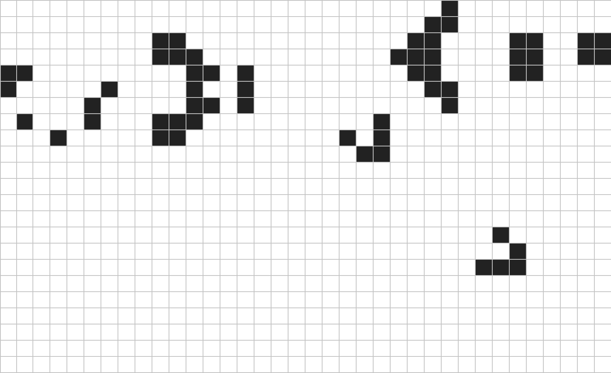

# **Conways Game of Life**

Conway's Game of Life is a cellular automaton devised by mathematician John Horton Conway. 

It's a zero-player game, meaning its evolution is determined by its initial state, requiring no further input from human players. 

Our game takes place on a 16 by 16 grid of cells, which can be alive or dead. Cells evolve through generations based on simple rules regarding the number of live neighbors. This setup leads to complex behaviors and patterns. 

## **_Rules_ to Life**:

1. Any live cell with two or three live neighbors lives on to the next generation.

2. Any live cell with fewer than two live neighbors dies, as if by underpopulation.

3. Any live cell with more than three live neighbors dies, as if by overpopulation.

4. Any dead cell with exactly three live neighbors becomes a live cell, as if by reproduction.

# Nexys4 board Verilog Implementation Project Details

## When alive, this is what a cell in our game will look like:

## EE354 State Diagram:

